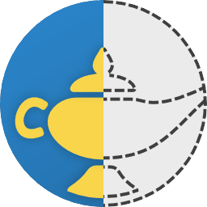

<div align="center">



# PyDjinni - Project Template


Project template using PyDjinni with Conan and CMake to build a library for multiple different target systems.

</div>

## Build Instructions

- Install the Python dependencies:
  ```sh
  pip install -r requirements.txt
  ```
- Run the PyDjinni package commands to build for Android, iOS, macOS and Windows:
  ```sh
  pydjinni package aar android
  pydjinni package swiftpackage ios ios_simulator macos
  pydjinni package nuget windows
  ```
  
## Unit Testing

Manually run the Unit-tests for the library (that test just the C++ code correctness):

- Linux, macOS:
  ```sh
  conan install . --output-folder=build --build=missing
  cd build
  cmake .. -DCMAKE_TOOLCHAIN_FILE=conan_toolchain.cmake -DCMAKE_BUILD_TYPE=Release
  cmake --build . --target tests
  ctest --output-on-failure
  ```
  > [!WARNING]
  > This will not work out of the box with the "XCode" generator, see https://github.com/catchorg/Catch2/issues/2411
  
- Windows:
  ```sh
  conan install . --output-folder=build --build=missing
  cd build
  # assuming Visual Studio 17 2022 is your VS version and that it matches your default profile
  cmake .. -G "Visual Studio 17 2022" -DCMAKE_TOOLCHAIN_FILE=conan_toolchain.cmake
  cmake --build . --config Release --target tests
  ctest --output-on-failure
  ```